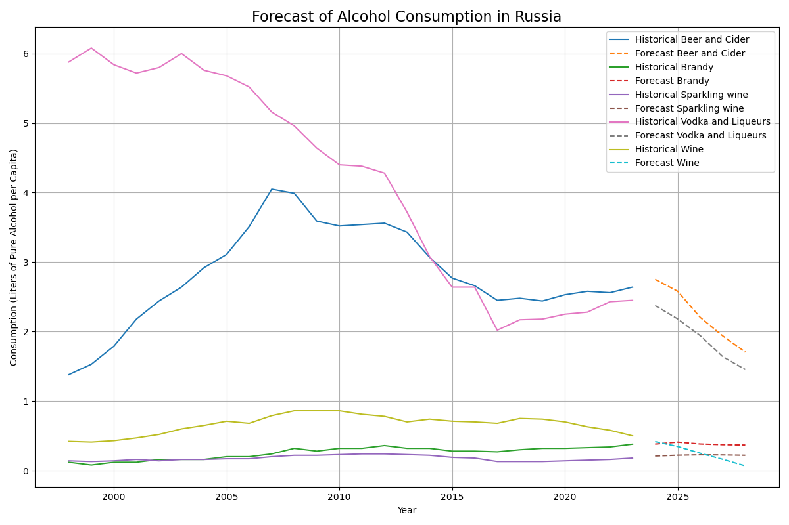
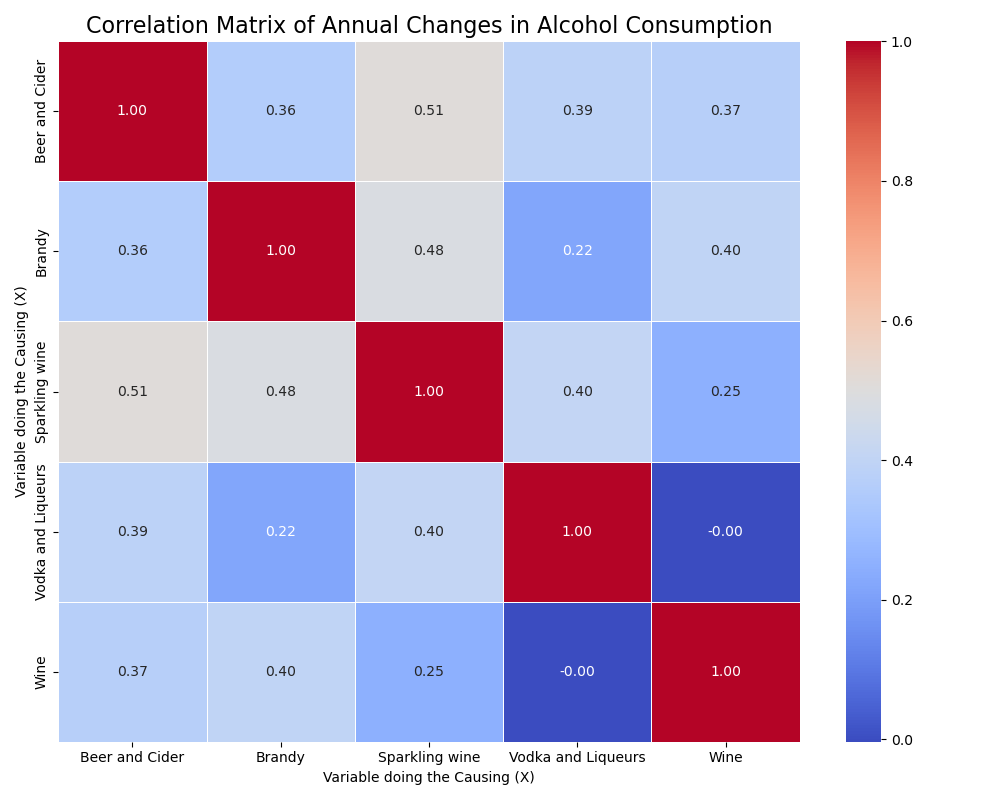
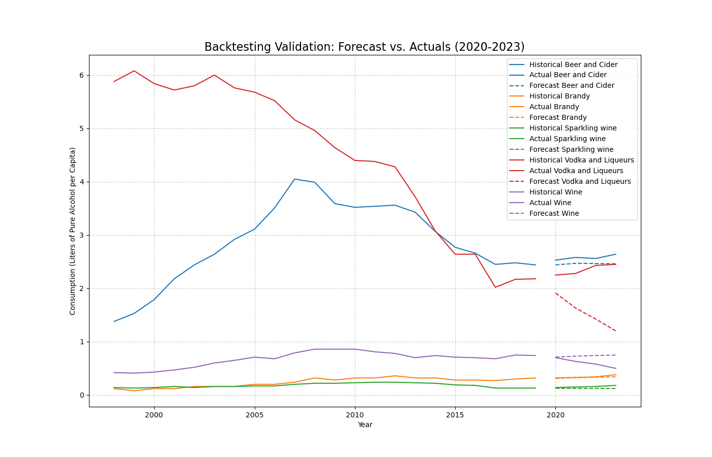

# **Russian Alcohol Consumption Analysis (1998-2023)**

This project provides an in-depth analysis of alcohol consumption trends in Russia from 1998 to 2023. Using time series analysis, it explores the relationships between the consumption of different alcoholic beverages and forecasts future trends.

## **Key Visualizations**

### **Consumption Forecast**

The following chart displays the historical consumption of various alcoholic beverages, along with a forecast for the next five years based on a VAR model.



### **Correlation Heatmap**

This heatmap illustrates the correlations in the annual changes of consumption between different types of alcohol.



### **Backtesting and Validation**

The model's performance was validated by training on data up to 2019 and testing against the actuals from 2020-2023.



## **Methodology**

The analysis is conducted in the `russian_alcohol_consumption_analysis.ipynb` notebook and follows these key steps:

1.  **Data Preprocessing**: The dataset is loaded, cleaned, and transformed from a long to a wide format.
2.  **Stationarity Testing**: The Augmented Dickey-Fuller (ADF) test is used to check for stationarity in the time series data. Non-stationary series are treated with first-order differencing.
3.  **Vector Autoregression (VAR) Model**:
    *   **Granger Causality**: To test for causal relationships between beverage consumption.
    *   **Forecasting**: A VAR model is fitted to the data to forecast future consumption.
    *   **Impulse Response Function (IRF)**: To analyze how a shock in one variable affects others.
4.  **VARMAX Model**: The analysis is extended with a VARMAX model to include the COVID-19 pandemic as an exogenous variable.

## **Repository Structure**

```
.
├── Consumption of alcoholic beverages in Russia 1998-2023.csv # The raw dataset
├── russian_alcohol_consumption_analysis.ipynb              # Jupyter Notebook with the complete analysis
├── requirements.txt                                          # Python dependencies
├── backtesting_validation_plot.png                           # Output: Backtesting validation plot
├── consumption_forecast.png                                  # Output: Consumption forecast plot
├── correlation_heatmap.png                                   # Output: Correlation heatmap
└── impulse_response_functions_adjusted.png                   # Output: Impulse Response Function plot
```

## **Getting Started**

To run this analysis on your local machine, follow these steps:

### **Prerequisites**

*   Python 3.x
*   pip

### **Installation**

1.  **Clone the repository:**
    ```bash
    git clone https://github.com/Raimundoivy/russian-alcohol-analysis
    cd russian_alcohol_consumption_analysis
    ```

2.  **Create and activate a virtual environment (recommended):**
    ```bash
    python -m venv venv
    source venv/bin/activate  # On Windows, use `venv\Scripts\activate`
    ```

3.  **Install the required dependencies:**
    ```bash
    pip install -r requirements.txt
    ```

4.  **Launch Jupyter Notebook:**
    ```bash
    jupyter notebook
    ```

    Now you can open and run the `russian_alcohol_consumption_analysis.ipynb` notebook.

## **Future Work**

*   **Incorporate External Factors**: Enhance the model by including economic indicators (GDP, inflation), demographic data, or public health policies.
*   **Explore Alternative Models**: Experiment with other time series models like SARIMA or machine learning models like LSTMs.
*   **Regional Analysis**: If regional data is available, conduct a more granular analysis of consumption patterns across Russia.
*   **Interactive Dashboard**: Create an interactive dashboard with Plotly/Dash to visualize the results.
